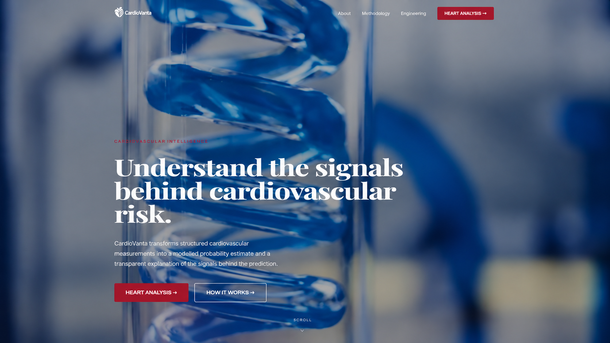
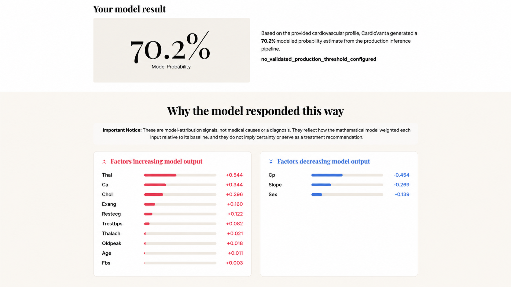
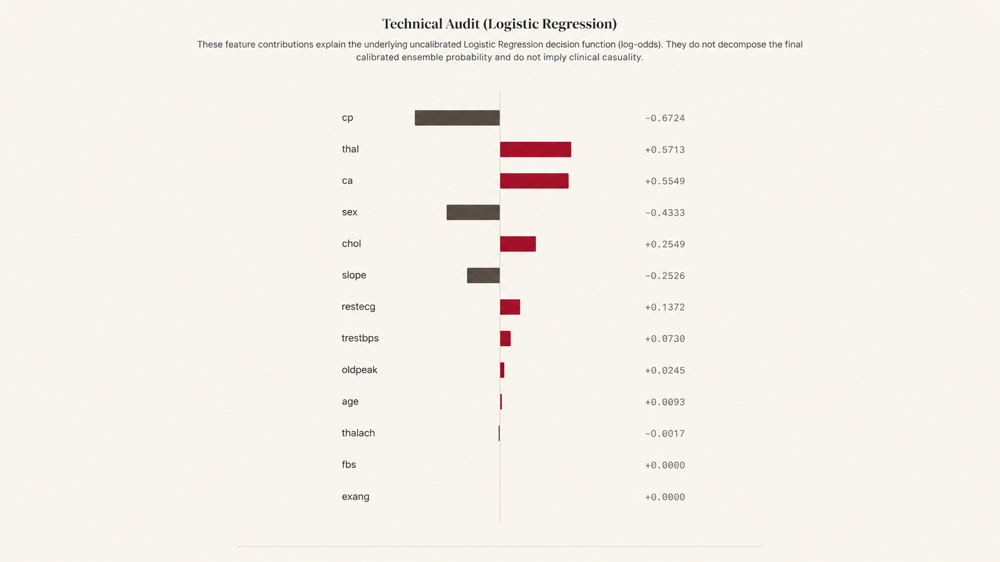
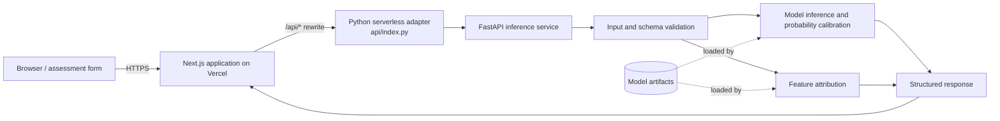
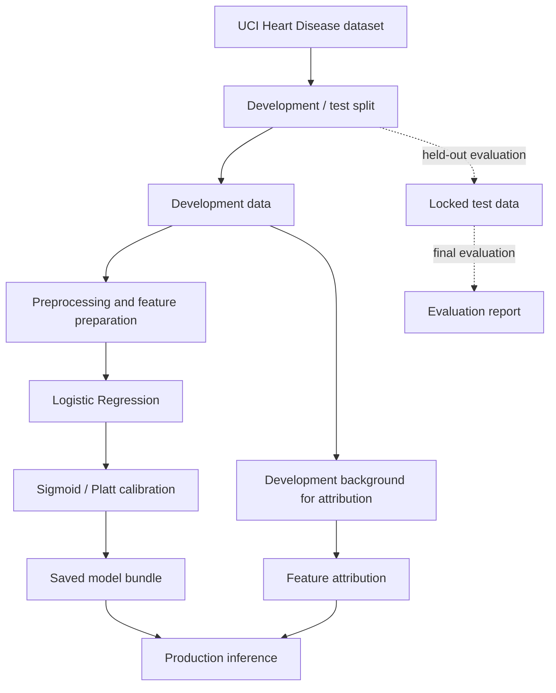

<div align="center">


### Interpretable machine learning for structured cardiovascular risk estimation.

Explore how 13 structured measurements inform a modelled probability estimate — with a transparent view of the model's feature contributions.

<br>

[](https://cardio-vanta-prod.vercel.app/)
[](https://cardio-vanta-prod.vercel.app/assessment)
[](https://github.com/septilex/CardioVanta)

<br>

[](https://github.com/septilex/CardioVanta/actions/workflows/verify.yml)


</div>

> [!IMPORTANT]
> **Responsible use:** CardioVanta is an ML engineering and educational/research project. It is not a medical device and has not been clinically validated. Its outputs must not be used for diagnosis, treatment, or medical advice. Do not submit real patient data.

<p align="center">
  
</p>

## Contents

- [Overview](#overview)
- [Highlights](#highlights)
- [Application walkthrough](#application-walkthrough)
- [System architecture](#system-architecture)
- [Dataset](#dataset)
- [Input schema](#input-schema)
- [Model methodology](#model-methodology)
- [Explainability and technical audit](#explainability-and-technical-audit)
- [Inference lifecycle](#inference-lifecycle)
- [Repository structure](#repository-structure)
- [Technology stack](#technology-stack)
- [Local development](#local-development)
- [Testing and engineering quality](#testing-and-engineering-quality)
- [Deployment and monitoring](#deployment-and-monitoring)
- [Responsible use and limitations](#responsible-use-and-limitations)
- [References and license](#references-and-license)
- [Screenshot assets](#screenshot-assets)

---

## Overview

CardioVanta turns 13 structured cardiovascular measurements into a **modelled probability estimate** and displays feature-level contributions that help explain how the model responded to a particular input profile. The application is designed to show the result alongside its explanation and limitations rather than presenting a number without context.

The experience brings together three layers:

| Layer | Role |
|---|---|
| **Assessment interface** | Collects the model's 13 required inputs across patient profile, vitals and laboratory measurements, exercise response, and diagnostic markers. The live form indicates that partial profiles are not scored. |
| **Inference service** | The published application describes a Python/FastAPI backend using Logistic Regression with sigmoid/Platt probability calibration and feature contributions. Some implementation details still require source-level verification. |
| **Engineering and verification** | The project documentation describes automated tests, model-artifact integrity checks, dependency audits, and GitHub Actions. The workflow files and current test results have not been independently inspected for this README. |

### Highlights

- A structured assessment flow requiring all 13 model inputs.
- A probability estimate described by the application as sigmoid/Platt calibrated.
- Feature-attribution visuals separated from the technical audit of the underlying Logistic Regression decision function.
- A `no_validated_production_threshold_configured` status rather than an unsupported positive/negative decision threshold.
- A Next.js application deployed on Vercel, with a Python serverless API adapter described in the repository configuration.
- A documented engineering workflow for tests, artifact verification, and dependency checks.

## Application walkthrough

### 1. Model methodology

The methodology section presents four ideas: Logistic Regression, Platt scaling, SHAP-equivalent attribution, and strict isolation between development and test data. The exact training and calibration protocol should be checked against the implementation before treating every diagram label as a verified implementation detail.

<p align="center">
  
</p>

### 2. Model result and feature attribution

The result interface presents a modelled probability alongside factors that increase or decrease the model's output.

<p align="center">
  
</p>

The **70.2%** value shown in this visual is an illustrative example. It is not model accuracy, a performance metric, or a clinically validated estimate of an individual's real-world risk. The status `no_validated_production_threshold_configured` indicates that the product does not establish a validated threshold for converting this estimate into a positive/negative decision.

### 3. Technical attribution audit

A separate audit chart shows example feature contributions on the underlying Logistic Regression log-odds scale. These values should not be interpreted as direct percentage-point changes in the calibrated probability.

<p align="center">
  
</p>

> **Screenshot note:** These are high-resolution visual recreations based on supplied reference images, not pixel-exact captures of the live application. Two screenshots show different illustrative values for some features; the examples are not intended to be reconciled as one prediction.

## System architecture

The project is described as a monorepo with a Vercel deployment. The root `vercel.json` is reported to rewrite `/api/*` requests to `api/index.py` and bundle relevant project directories for the Python function. The internal backend call graph and route schemas still need direct inspection.



The diagram reflects the architecture described by the repository's top-level configuration and the deployed application's public descriptions. The specific backend module names, API routes, response schema, and artifact-loading implementation have not yet been verified from source.

### End-to-end ML workflow



The live application and existing project documentation describe a locked test set, five-fold sigmoid calibration, and a frozen development background for attribution. The exact split boundaries, fold protocol, saved estimator composition, and test-set usage must be checked against the training code before they can be treated as independently verified.

## Dataset

The project identifies the **UCI Machine Learning Repository Heart Disease dataset** as its data source. The UCI listing describes 303 instances and 13 features, while also noting that the source database contains more raw attributes and that a processed Cleveland subset is commonly used in machine-learning experiments.

| Item | Current documentation status |
|---|---|
| Dataset source | UCI Machine Learning Repository, Heart Disease, dataset ID 45 |
| Dataset DOI | [10.24432/C52P4X](https://doi.org/10.24432/C52P4X) |
| Dataset license | CC BY 4.0, according to the UCI dataset page |
| Exact file/variant used by training | Needs source-level verification |
| Target definition and binarization | Needs source-level verification |
| Train/test sizes and class balance | Not yet established from an accessible training report |
| Preprocessing and imputation | Needs source-level verification |
| Evaluation metrics | Not included because no evaluation report was verified for this README |

The assessment UI offers guidance about the input cohort, including an age range of 29–77 and a development median age of 55. Treat such UI hints as interface guidance, not a substitute for the dataset or training specification.

The dataset is small and retrospective. Performance on one public dataset, even with a careful held-out evaluation, does not automatically generalize to other populations, devices, or clinical settings and does not establish clinical validity.

## Input schema

The live assessment interface requires all 13 inputs before generating an analysis. The table below summarizes the visible labels and units. Canonical model ordering, integer encodings, accepted server-side ranges, and invalid-input behavior must be confirmed against the backend schema.

| Key | Input label | Type shown in the UI | Options / units shown |
|---|---|---|---|
| `age` | Age | Numeric | Years |
| `sex` | Sex (biological sex recorded at baseline intake) | Choice | Male, Female |
| `cp` | Chest Pain Type | Choice | Typical Angina, Atypical Angina, Non-anginal Pain, Asymptomatic |
| `trestbps` | Resting Blood Pressure | Numeric | mmHg |
| `chol` | Serum Cholesterol | Numeric | mg/dL |
| `fbs` | Fasting Blood Sugar > 120 mg/dL | Choice | False, True |
| `restecg` | Resting ECG Results | Choice | Normal, ST-T Wave Abnormality, Left Ventricular Hypertrophy |
| `thalach` | Maximum Heart Rate Achieved | Numeric | bpm |
| `exang` | Exercise-Induced Angina | Choice | No, Yes |
| `oldpeak` | ST Depression Induced by Exercise | Numeric | mm, as labelled in the form |
| `slope` | Slope of Peak Exercise ST Segment | Choice | Upsloping, Flat, Downsloping |
| `ca` | Number of Major Vessels | Choice | 0, 1, 2, 3, 4 |
| `thal` | Thallium Stress Test | Choice | Unknown, Normal, Fixed Defect, Reversible Defect |

**Schema details to verify:** how each UI choice maps to its encoded model value; the exact order expected by the model; numeric bounds; treatment of unknown or missing categorical values; and the API error returned for incomplete or invalid payloads. The form's helper text is not, by itself, a backend validation specification.

## Model methodology

### Logistic Regression

The deployed assessment page labels the model **Logistic Regression (Sigmoid Calibrated), v1.0.0**. In its standard form, Logistic Regression computes a linear decision score and maps that score through a sigmoid function:

\[
z = \beta_0 + \sum_{i=1}^{13}\beta_i x_i
\]

\[
p = \frac{1}{1+e^{-z}}
\]

where \(x_i\) is a preprocessed feature, \(\beta_i\) is its learned coefficient, \(\beta_0\) is the intercept, and \(z\) is the score on the log-odds scale for the model's positive class. The sigmoid maps this score to the base model probability.

These are standard equations for the model family. The production preprocessing, coefficient space, regularization settings, and target-class encoding have not yet been verified from source.

A linear model can be useful for interpretability because its decision score is composed of additive feature terms. However, interpreting a coefficient or contribution still depends on feature scaling, encoding, the selected target class, and the input being explained.

### Platt scaling and probability calibration

Platt scaling fits a logistic transformation to a model score. A commonly used form is:

\[
p_{\text{cal}} = \frac{1}{1+e^{As+B}}
\]

where \(s\) is the input score and \(A\) and \(B\) are fitted calibration parameters. The exact sign convention depends on the implementation.

The application describes its output as a **Platt-scaled calibrated probability estimate** and refers to **five-fold sigmoid calibration**. The precise fold protocol, calibration data, and saved estimator arrangement—such as whether production uses one refitted estimator and calibrator or a fold-wise calibrated ensemble—still require verification in the training and inference code.

Two important distinctions:

- **Calibration is not discrimination.** Calibration concerns agreement between predicted probabilities and observed event frequencies; discrimination concerns how well scores separate classes.
- **Calibration is not clinical validation.** A model can be calibrated on one development population and still fail to generalize to another population or setting.

### Data leakage prevention

The project description states that a locked test set is kept separate from training, tuning, and calibration. The intended protocol is to fit preprocessing and model-selection steps using development data, fit calibration without accessing the locked test set, and reserve that test set for final evaluation.

The exact implementation and tests that enforce these boundaries have not yet been inspected. The diagram above describes the stated protocol, not an independent audit result. Careful separation reduces leakage risk; it does not by itself prove generalization.

## Explainability and technical audit

### Feature attribution in the result interface

The application describes its explanation as **SHAP-equivalent linear attribution relative to a frozen development background**, implemented without the SHAP library. The exact implementation, preprocessing space, baseline statistics, and test coverage need source-level verification.

For a linear decision function, an additive attribution identity can be expressed as:

\[
\phi_i = \beta_i (x_i - \mu_i)
\]

\[
z(x) = z(\mu) + \sum_{i=1}^{13}\phi_i
\]

where \(\mu_i\) is the background value for feature \(i\), and \(z(\mu)\) is the baseline decision score. This identity is valid when the attribution implementation and its assumptions match the stated linear model and background definition. Confirm the exact code before treating these equations as a verified description of the production calculation.

The application and methodology artwork mention attribution under 1 ms, but a benchmark or measurement result was not verified for this README. No latency figure is claimed here.

### Technical audit: Logistic Regression contributions

The technical-audit visual shows example signed feature contributions on the **uncalibrated Logistic Regression log-odds scale**. Its caption distinguishes these contributions from the final calibrated probability.

| Feature | Example contribution | Feature | Example contribution |
|---|---:|---|---:|
| `cp` | −0.6724 | `restecg` | +0.1372 |
| `thal` | +0.5713 | `trestbps` | +0.0730 |
| `ca` | +0.5549 | `oldpeak` | +0.0245 |
| `sex` | −0.4333 | `age` | +0.0093 |
| `chol` | +0.2549 | `thalach` | −0.0017 |
| `slope` | −0.2526 | `fbs` | +0.0000 |
|  |  | `exang` | +0.0000 |

These values are illustrative and specific to the example input and model version represented by the visual. They are not universal model coefficients and should not be taken as a second output from the example result screenshot.

**How to interpret the chart:**

- A positive contribution raises the raw decision score for the model's positive class; a negative contribution lowers it. The target encoding must be checked before equating the positive class with disease presence.
- Larger absolute contributions indicate a larger movement away from the chosen baseline for that input. Values can change with the input, model version, scaling, and background.
- Near-zero values mean that the displayed contribution is close to zero at the shown precision for that example.

**Why these are not percentage-point changes:** the sigmoid is nonlinear, and a calibration transformation may apply another mapping. A contribution of `+0.5` on the log-odds scale does not mean a `+0.5` percentage-point change in calibrated probability. The total raw-score shift is not the change in calibrated probability.

**Why these are not medical causes:** feature contributions describe how the fitted model responds to its inputs. They do not establish causality, independently validate risk factors, or provide a diagnosis.

## Inference lifecycle

The public UI and repository-level configuration describe the flow below. API endpoint names, request/response fields, and error schemas still need verification from backend source.

1. **Submit:** the user completes all 13 fields in `/assessment` and requests an analysis.
2. **Route:** the frontend sends a request to the API; the Vercel configuration is described as rewriting `/api/*` to `api/index.py`.
3. **Validate:** the backend is expected to validate the submitted feature schema. The validation code and exact error responses need inspection.
4. **Predict:** the model bundle is described as producing a sigmoid/Platt-calibrated probability estimate.
5. **Attribute:** the application describes computing signed feature contributions relative to a frozen development background.
6. **Respond:** the inference service returns a result and attribution data, including the threshold status described by the UI.
7. **Render:** the frontend displays the estimate, increasing/decreasing factors, and technical audit information.

The existing project README says the frontend defaults to `http://localhost:8000` when `NEXT_PUBLIC_API_BASE_URL` is unset. Confirm this default against the current client implementation before changing it.

## Repository structure

The following is a high-level map based on paths referenced by the public project documentation and root listing. Verify each directory and its exact role against the current repository before relying on it for development.

```text
CardioVanta/
├── .github/workflows/   # CI workflows (verify.yml is referenced in project docs)
├── api/                 # Vercel Python serverless adapter; api/index.py is referenced
├── backend/             # Backend / inference service
├── artifacts/model/     # Model artifacts
├── src/                 # Application source and/or bundled serverless files
├── configs/              # Configuration
├── data/                 # Data-related files
├── reports/              # Evaluation or project reports
├── scripts/              # Utility and validation scripts
├── experiments/phase13/ # Experiment work
├── tests/                # Python / ML tests
├── __tests__/            # Frontend tests, if present
├── docs/                 # Documentation and README screenshot assets
├── public/               # Static assets
├── openspec/             # Project specifications, if present
├── audit_tests.py        # Audit test entry point referenced by project docs
├── vercel.json           # Vercel routing and bundle configuration
├── package.json          # Frontend scripts and dependencies
├── requirements.txt      # Python dependencies
└── .env.example          # Environment-variable template
```

## Technology stack

| Area | Technologies described by the repository or application |
|---|---|
| Frontend | Next.js App Router, React, TypeScript, Framer Motion |
| Backend | Python, FastAPI |
| Machine learning | scikit-learn, NumPy, pandas, SciPy, joblib |
| Testing and linting | pytest, Jest, Testing Library, ESLint |
| Deployment | Vercel |
| Automation | GitHub Actions |

Exact dependency versions should be taken from the current `package.json` and Python dependency files. XGBoost and other packages listed in the root requirements file should not be assumed to be used by the production inference path without inspecting their references.

## Local development

The existing project documentation specifies **Node.js 24** and **Python 3.11**. Confirm these against the current manifests and deployment environment if setting up from a fresh clone.

### 1. Clone the repository and install frontend dependencies

```bash
git clone https://github.com/septilex/CardioVanta.git
cd CardioVanta
npm ci
```

### 2. Create a Python environment

**Windows PowerShell**

```powershell
py -3.11 -m venv .venv311
.venv311\Scripts\Activate.ps1
python -m pip install --upgrade pip
pip install -r requirements.txt
```

**macOS / Linux**

```bash
python3.11 -m venv .venv311
source .venv311/bin/activate
python -m pip install --upgrade pip
pip install -r requirements.txt
```

> [!WARNING]
> The root `requirements.txt` reviewed for the draft did not list FastAPI or an ASGI server such as Uvicorn. Backend runtime dependencies may be defined in another dependency file. Confirm the backend's dependency instructions before treating the root requirements installation as sufficient.

### 3. Configure environment variables

Start from `.env.example` and use the variable formats expected by the code. Do not commit secrets or real patient data.

| Variable | Purpose described in project documentation | Note |
|---|---|---|
| `ENVIRONMENT` | Backend runtime environment label | Check the intended value for local development. |
| `CORS_ORIGINS` | Allowed browser origins | The existing repository README and `.env.example` reportedly show different formats; verify which parser the backend uses. |
| `NEXT_PUBLIC_API_BASE_URL` | Frontend API base URL | Existing documentation says it defaults to `http://localhost:8000` when unset; confirm against the client code. |

### 4. Start the frontend

```bash
npm run dev
```

The usual Next.js development URL is `http://localhost:3000`. The exact backend startup command cannot be documented confidently until the FastAPI application object and its dependency file are confirmed. Check the backend's own setup instructions rather than guessing the module path.

### 5. Open the assessment

Open `http://localhost:3000/assessment`, complete all 13 fields, and select **Generate Analysis**. The live UI includes example/default values; do not use real patient data in this educational project.

## Testing and engineering quality

The existing project documentation lists the following commands. They are documented here as project commands, **not as a claim that they were run or passed during preparation of this README**.

```bash
pytest tests/
pytest backend/tests/
npm run test
npx eslint .
npx openspec validate --all
npm run build
```

On Windows, the existing documentation also refers to invoking pytest through the virtual environment, for example:

```powershell
.venv311\Scripts\pytest tests\
.venv311\Scripts\pytest backend\tests\
```

The project documentation mentions model-artifact integrity verification and dependency audits such as `pip-audit` and `npm audit --audit-level=critical`. Inspect the current workflow and scripts for their exact commands and prerequisites.

**Known documentation mismatch to resolve:** the existing README refers to `npm run typecheck`, while the `package.json` reviewed for that draft reportedly only defined `dev`, `build`, `start`, `lint`, and `test`. A direct check using `npx tsc --noEmit` may be possible if TypeScript and the project's `tsconfig.json` are present, but adding or changing a package script should be a separate, deliberate code change.

No test counts, coverage figures, successful CI runs, or passing deployment checks are asserted here.

## Deployment and monitoring

### Deployment

Project documentation describes a single Vercel deployment in which Next.js serves the frontend and `/api/*` requests are rewritten to the Python adapter at `api/index.py`. The reported `vercel.json` includes application and model-related directories in the Python function bundle. Confirm the current workflow file before relying on its exact triggers, job order, or deployment gates.

The project's documentation describes a verification pipeline including backend and frontend tests, artifact-integrity checks, dependency audits, deployment, and a post-deployment smoke test. The underlying workflow and its recent run history should be checked in [GitHub Actions](https://github.com/septilex/CardioVanta/actions).

### Monitoring and drift detection

The live application describes drift detection using two-sample Kolmogorov–Smirnov statistics, Monte Carlo permutation testing, and support-boundary checks. The implementation module, execution cadence, alerting path, and connection to live production traffic have not been verified for this README. Treat these as documented design claims until the relevant source is inspected.

## Responsible use and limitations

- CardioVanta is an ML engineering and educational/research project, not a validated clinical decision-support tool.
- The output is not a diagnosis and should not be treated as an individualized, clinically validated estimate of real-world risk.
- Feature contributions describe the behavior of the model, not clinical causality.
- Probability calibration does not establish clinical utility or generalization to a different population.
- The data source is small and retrospective; dataset shift and population differences may materially affect results.
- The application indicates that no validated production threshold is configured, so an estimate should not be interpreted as a positive/negative diagnosis.
- Medical decisions require appropriately validated tools and qualified healthcare professionals.
- The application has not been established as a regulated medical device.

### Privacy note

The live site describes privacy controls around telemetry and submitted data. Those claims have not been independently audited against the implementation for this README. Do not submit real patient data until the project's data flow, logging, retention, and access controls have been explicitly reviewed.

## References and license

**Dataset:** Janosi, A., Steinbrunn, W., Pfisterer, M., & Detrano, R. *Heart Disease* [Dataset]. UCI Machine Learning Repository. [https://doi.org/10.24432/C52P4X](https://doi.org/10.24432/C52P4X). The dataset page identifies the dataset as CC BY 4.0.

**Related publication listed by the dataset page:** Detrano, R., Janosi, A., Steinbrunn, W., Pfisterer, M., Schmid, J., Sandhu, S., Guppy, K., Lee, S., & Froelicher, V. “International application of a new probability algorithm for the diagnosis of coronary artery disease.” *American Journal of Cardiology*, 64, 304–310.

**Project license:** The repository review available for this draft did not identify a root `LICENSE` file. Confirm the current repository before making reuse claims. Without a project license, do not assume that others have permission to reuse the project's code.

## Screenshot assets

The four images are stored under `docs/assets/readme/` and are referenced using repository-relative paths. Commit the assets with `README.md` so GitHub can render them.

If you downloaded the screenshot archive, extract it at the root of the repository—the same directory that contains `package.json` and `README.md`. It should create the following structure:

```text
docs/
└── assets/
    └── readme/
        ├── 01-landing-hero.png
        ├── 02-model-methodology.png
        ├── 03-model-results-and-attribution.png
        └── 04-technical-audit-logistic-regression.png
```

Then stage the README and images together:

```bash
git add README.md docs/assets/readme/
git commit -m "docs: improve CardioVanta README"
git push
```

The README is intentionally careful about claims whose implementation could not be inspected in the available project material. The next verification pass should prioritize the training and calibration code, attribution module, model schema and target encoding, backend dependency file and API entry point, evaluation reports, and `.github/workflows/verify.yml`.

---

<div align="center">

[Live application](https://cardio-vanta-prod.vercel.app/) · [Assessment](https://cardio-vanta-prod.vercel.app/assessment) · [GitHub repository](https://github.com/septilex/CardioVanta) · [GitHub Actions](https://github.com/septilex/CardioVanta/actions)

</div>
